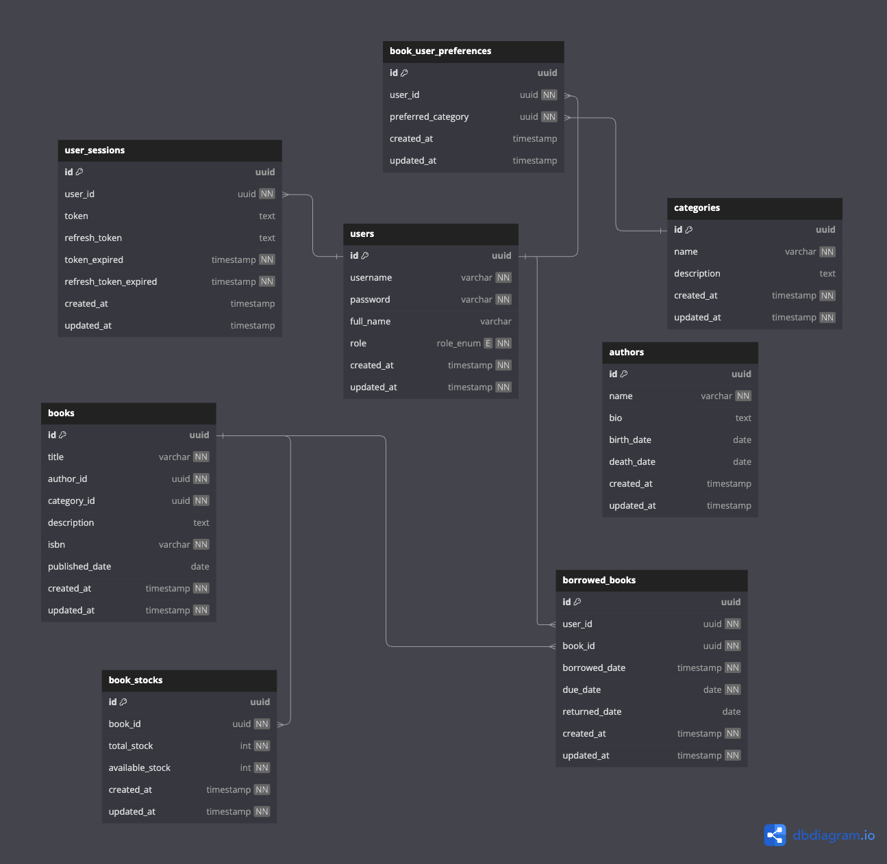

# Library Category Management

A scalable and efficient service for managing categories in the Library Management System. Built using **Golang**, **PostgreSQL**, and **Redis**, this microservice adheres to modern software architecture practices with features like gRPC communication, JWT-based security, and caching.

---

## Features

- **Category Management**: Allows management of categories for books in the library system.
- **Microservice Ready**: Designed to be integrated with other services via gRPC.
- **Caching**: Redis is used for improved performance in storing and retrieving category data.
- **Scalability**: Modular architecture with PostgreSQL and Redis for high availability.
- **Easy Migration**: Database migrations managed with `goose`.

---

## Technologies

- **Programming Language**: Golang 1.22.7
- **Database**: PostgreSQL
- **Cache**: Redis
- **gRPC**: Inter-service communication
- **JWT**: Authentication and authorization

---

## Getting Started

### Prerequisites

- Install [Golang](https://golang.org/dl/)
- Install [PostgreSQL](https://www.postgresql.org/download/)
- Install [Redis](https://redis.io/download)

---

### Setup Instructions

#### Using Docker

1. **Pull the Docker Image**:  
    Download the prebuilt Docker image from Docker Hub:  
    ```bash
    docker pull ikhsanhilmi/library-category-service-app
    ```

2. **Run the Container**:  
    Start the container with the following command:  
    ```bash
    docker run -d \
      --name library-category-service \
      -p 9091:9091 \
      -e POSTGRES_URL=postgresql://<user>:<password>@<host>:<port>/<dbname> \
      -e REDIS_URL=redis://<host>:<port> \
      -e JWT_SECRET=<your_jwt_secret> \
      ikhsanhilmi/library-category-service-app
    ```
    Replace `<user>`, `<password>`, `<host>`, `<port>`, `<dbname>`, and `<your_jwt_secret>` with the appropriate credentials and secrets.

3. **Verify the Service**:  
    Access the service at `http://localhost:9091`.

---

### Database Migrations

Manage database migrations using `goose`:

- Create a new migration:
    ```bash
    make goose-create name=create_categories_table
    ```
- Apply migrations:
    ```bash
    make goose-up
    ```
- Rollback migrations:
    ```bash
    make goose-down
    ```
- Check migration status:
    ```bash
    make goose-status
    ```

---

### ERD (Entity-Relationship Diagram)



---

### Development

#### Testing

Run unit tests with coverage:
```bash
make test
